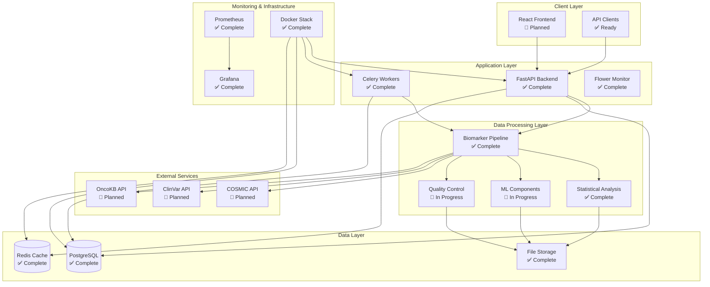
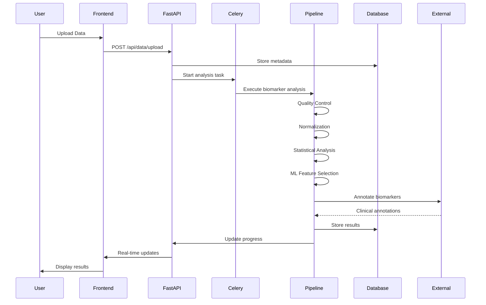
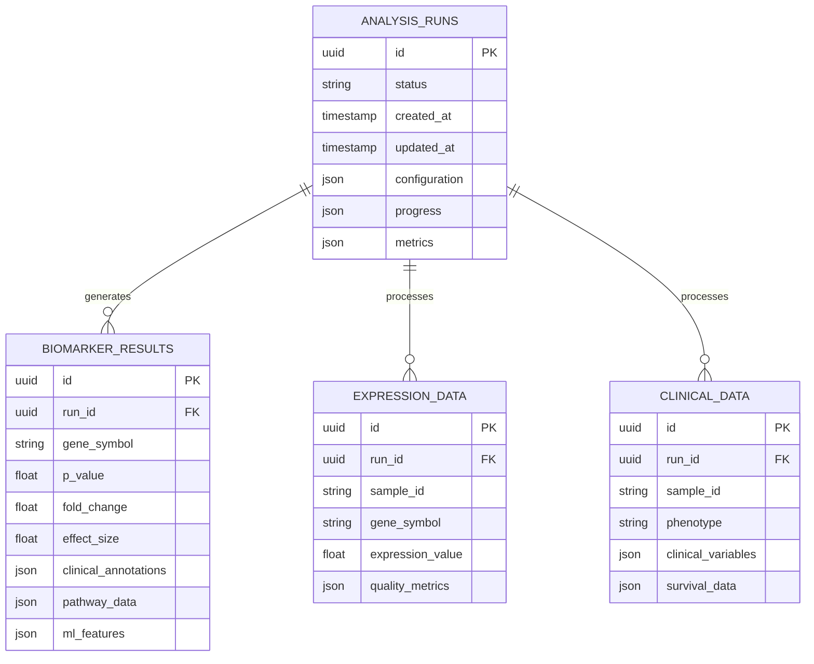
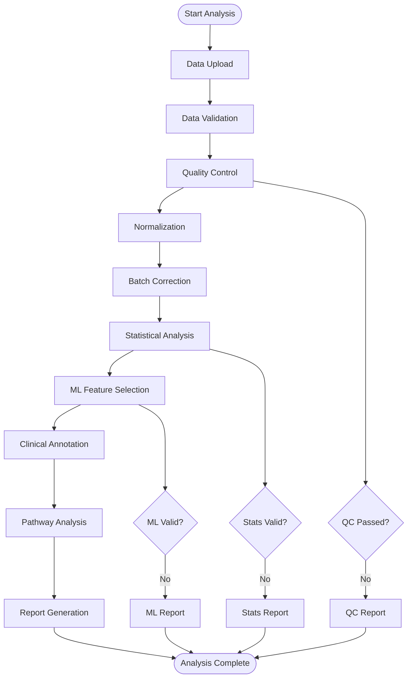
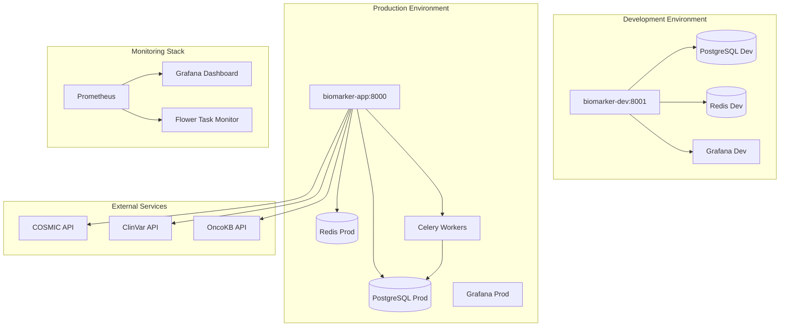
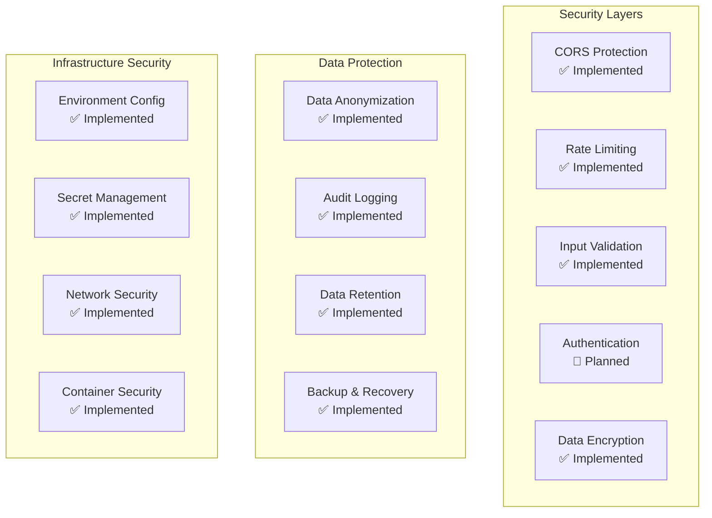
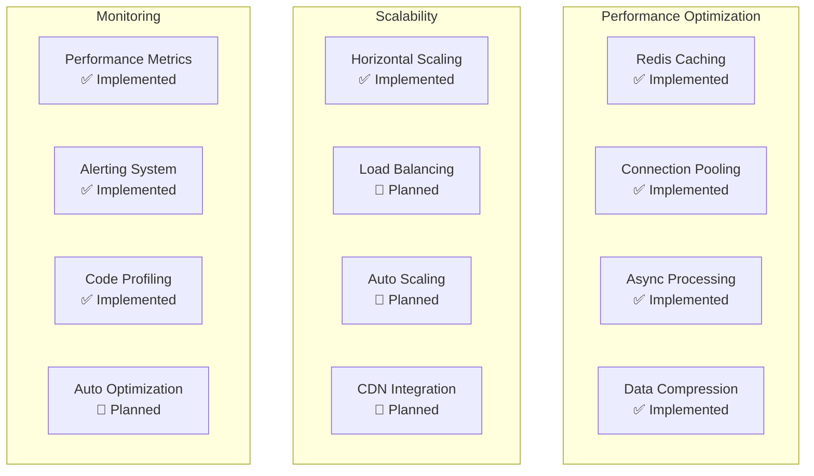

# System Architecture Diagrams
## Cancer Biomarker Identifier - Week 2 Progress

### Overall System Architecture

### Data Flow Architecture

### Database Schema Architecture

### Pipeline Processing Flow

### Deployment Architecture

### Component Status Legend

- ✅ **Complete**: Fully implemented and tested
- 🚧 **In Progress**: Partially implemented
- ❌ **Not Started**: Planned but not yet implemented
- 🔄 **Planned**: Scheduled for future implementation

### Technology Stack Details

| Layer | Technology | Version | Status | Purpose |
|-------|------------|---------|--------|---------|
| **Frontend** | React | 18.x | 🚧 Planned | User interface |
| **Backend** | FastAPI | 0.104+ | ✅ Complete | API server |
| **Database** | PostgreSQL | 15+ | ✅ Complete | Primary database |
| **Cache** | Redis | 7+ | ✅ Complete | Caching & task queue |
| **Task Queue** | Celery | 5.3+ | ✅ Complete | Background processing |
| **Container** | Docker | 24+ | ✅ Complete | Containerization |
| **Monitoring** | Prometheus | 2.45+ | ✅ Complete | Metrics collection |
| **Visualization** | Grafana | 10+ | ✅ Complete | Monitoring dashboard |
| **ML** | scikit-learn | 1.3+ | 🚧 In Progress | Machine learning |
| **Stats** | SciPy | 1.11+ | ✅ Complete | Statistical analysis |

### Security Architecture

### Performance Architecture

---

## Architecture Decisions

### 1. Microservices Architecture
**Decision**: Implemented modular microservices architecture
**Rationale**: Enables independent scaling, easier maintenance, and technology diversity
**Status**: ✅ Implemented

### 2. Event-Driven Processing
**Decision**: Used Celery for asynchronous task processing
**Rationale**: Handles long-running analysis tasks without blocking the API
**Status**: ✅ Implemented

### 3. Container-First Deployment
**Decision**: Docker-based deployment with Docker Compose
**Rationale**: Ensures consistency across environments and simplifies deployment
**Status**: ✅ Implemented

### 4. Database Design
**Decision**: PostgreSQL with JSON fields for flexible data storage
**Rationale**: Balances structured data with flexibility for multi-omics data
**Status**: ✅ Implemented

### 5. Monitoring Integration
**Decision**: Prometheus + Grafana for comprehensive monitoring
**Rationale**: Provides observability for production deployment
**Status**: ✅ Implemented

---

**Last Updated**: April 2026 (align diagrams with `docs/PRODUCT_ROADMAP.md` and `docker-compose.yml` when making structural changes)  
**Version**: 1.0.0  
**Status**: Week 2 - Core Architecture Complete
